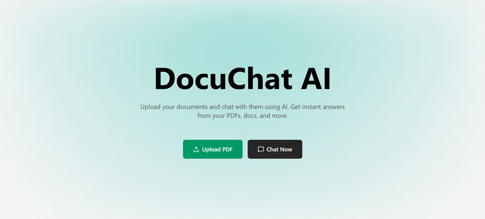
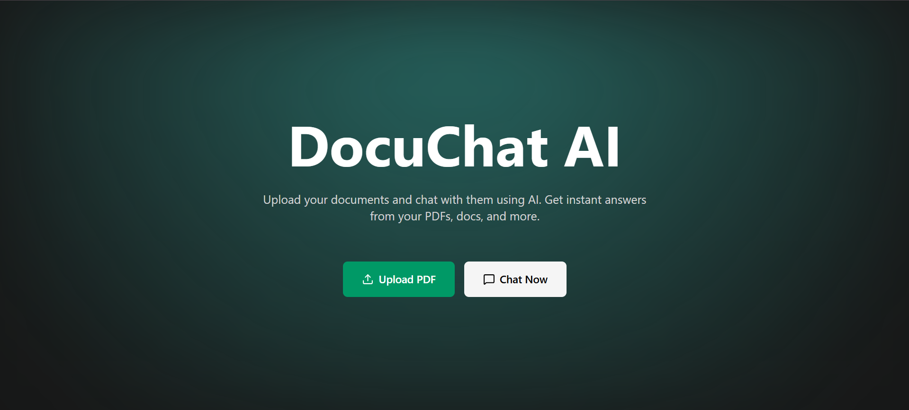
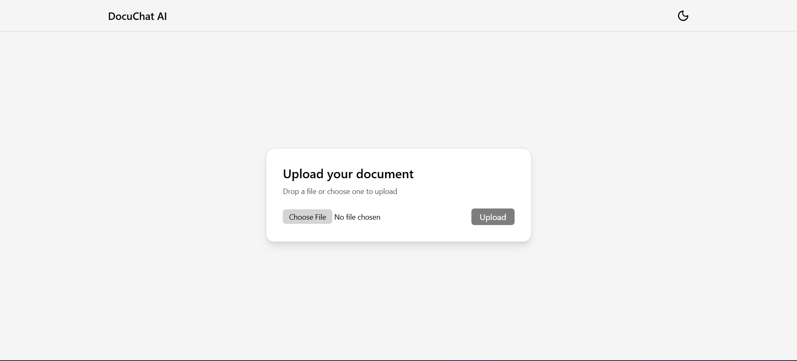
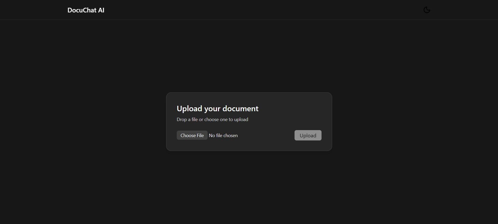
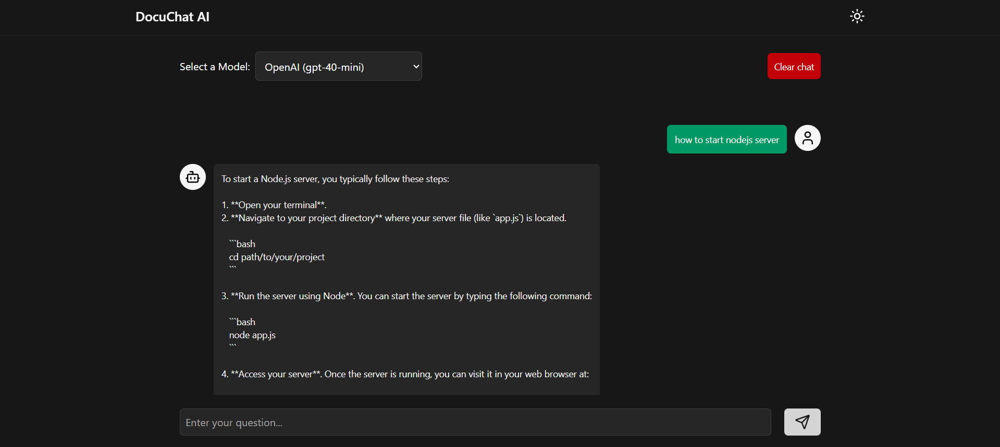
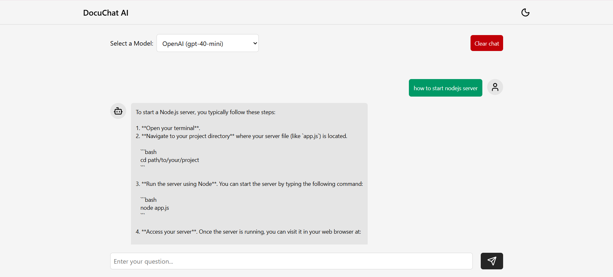

# DocuChat AI

Chat with your own PDFs. Upload a document, ask questions, and get answers with sources.

## Live

Production: https://docu-chat-ai-project.vercel.app/

## Overview

- Upload a PDF and we parse the text, split it into chunks, embed those chunks, and store them in Pinecone.
- Ask questions on the Chat page. The app retrieves the most relevant chunks and streams a model response with citations.
- Works with OpenAI (GPT‑4o‑mini) or Google Gemini 2.0 Flash. Local history persists in your browser.

## Quick start

Requirements: Node.js 18+ and API keys for OpenAI, Pinecone, and Google Gemini.

1. Install

```bash
npm install
```

2. Environment
   Create `.env.local` in the project root:

```env
OPENAI_API_KEY=your_openai_api_key
PINECONE_API_KEY=your_pinecone_api_key
PINECONE_INDEX_NAME=your_index_name
GOOGLE_GENERATIVE_AI_API_KEY=your_google_ai_key
```

3. Run

```bash
npm run dev
# open http://localhost:3000
```

## Screenshots / demo








> Tip: If you don’t have these images yet, place your screenshots/GIFs in `public/screenshots/` using the names above, or update the paths.

## Frontend details

- Framework: Next.js App Router (pages are in `app/`).
   - `/` – Landing page with CTA buttons.
   - `/upload` – PDF upload; shows basic status and a “Start Chat” button on success.
   - `/chat` – Streaming chat UI with model selector and citations.
- Components:
   - `Header` – sticky header with brand and theme toggle (client component).
   - `ThemeToggle` – toggles `light`/`dark` via `next-themes`.
   - `ChatInterface` – renders user/assistant bubbles and a compact sources list.
- Theming:
   - `next-themes` Provider in `app/layout.tsx` with `attribute="class"`, `defaultTheme="dark"`, `enableSystem=false`.
   - Tailwind dark mode is class-based. Toggle switches the `html` class so styles update instantly.
- Styling:
   - Tailwind CSS v4 with PostCSS plugin (`@tailwindcss/postcss`), imported once in `app/globals.css`.
   - Neutral palette, accessible contrast, and responsive layouts.
- Responsiveness:
   - Uses `svh` for stable mobile viewport sizing.
   - Chat input bar is fixed at the bottom; the messages list has extra bottom padding to avoid overlap.
   - Small screens stack controls; large screens align them inline.
- Streaming on client:
   - `app/chat/page.tsx` reads the `ReadableStream` from `/api/chat` and appends chunks to the latest assistant message.
   - Sources arrive via the `X-Sources` header (base64 JSON) and are shown under the assistant reply.
- Persistence:
   - Chat history is saved to `localStorage` as `chat-history` and restored on load.

## Architecture

- Parsing: `pdf-parse-fork` extracts text from the uploaded PDF.
- Chunking: utility `chunkText` splits text (default ~1000 chars, 200 overlap).
- Embeddings: OpenAI `text-embedding-3-small` → 1536-d vectors.
- Vector DB: Pinecone (cosine similarity). Metadata includes `text`, `source`, `chunkIndex`.
- Retrieval: top matches are included as context for the chat model.
- Generation: model streams the answer to the client; sources are returned via a response header and shown below the reply.

## Commands

```bash
npm run dev      # start dev server
npm run build    # production build
npm start        # start production server
```

## Notes

- Tech: Next.js (App Router), React 19, TypeScript, Tailwind CSS v4, Vercel AI SDK, Pinecone.
- Models: Chat → OpenAI GPT‑4o‑mini or Gemini 2.0 Flash. Embeddings → OpenAI `text-embedding-3-small`.
- Data: Uploaded text is embedded and stored in your Pinecone index. Browser stores chat history locally.

---
